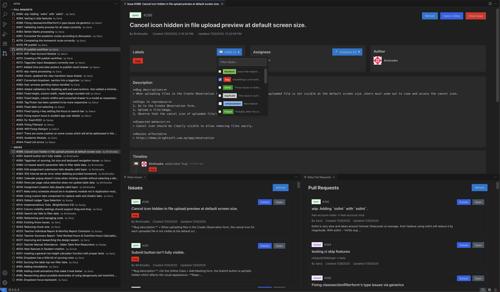

# Gitea Integration for VS Code

A modern VS Code extension to integrate with Gitea repositories, allowing you to view and manage pull requests and issues directly from VS Code with improved UI and better development experience.


## Features

- View all pull requests and issues in a tree view panel
- View all issues and pull requests in a detailed panel
- View detailed timeline of events for individual issues and pull requests in a separate panel
- Add, Edit or Delete comments to pull requests and issues
- Assign participants to issues
- Add labels to issues
- Close or Open pull requests and issues(create/add issue/pullrequest coming soon)
- Detailed view for individual pull requests and issues
- Timeline view showing events for issues and pull requests
- VS Code theme-aware UI components

## Configuration

Add the following settings to your VS Code User settings(or simply open extension page, click on the settings icon and fill in the required text fields):

```json
{
  "gitea.instanceURL": "[Your server instance address]",
  "gitea.owner": "[Owner of the gitea repo]",
  "gitea.repo": "[Repo name]",
  "gitea.token": "[Access token for the user]"
}
```

## Commands

Type Gitea in the command palette to see available commands

## Tree Views

The extension adds two tree views to the Explorer panel:

1. **Gitea Pull Requests** - Shows a list of all pull requests
2. **Gitea Issues** - Shows a list of all issues

Click on any item to see detailed information in a panel view.

## License

MIT License
